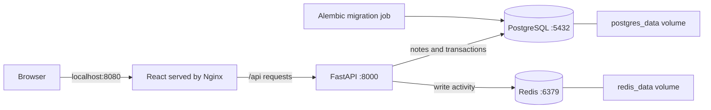

# Notebook — Full-stack Notes App

[](https://github.com/SriVishnu230707/notes-app-docker-documentation/actions/workflows/ci.yml)

A personal notes app built with **React, FastAPI, PostgreSQL and Redis**, running together with **Docker Compose**. Create, search and edit notes in a responsive notebook interface, with persistent storage and protection against conflicting edits.

The repository also demonstrates the complete Docker workflow: images, networking, environment configuration, migrations, automated tests, release packaging, backup recovery and resource limits. It is designed for **local, single-user use**; public hosting requires authentication, HTTPS and deployment-specific configuration.

[Quick start](#quick-start) · [Architecture](#architecture) · [Development](#development) · [Docker commands](#docker-commands) · [Testing](#testing) · [Backup and recovery](#backup-and-recovery) · [Guides](#guides)

## Features

- Create, edit, delete and search notes by title or content.
- Preserve drafts after failed saves and confirm before discarding unsaved edits.
- Detect stale saves/deletes across browser tabs with note versions and `If-Match`.
- Keep notes in PostgreSQL volumes and track successful mutations in Redis.
- Apply versioned database migrations before starting the API.
- Run production and development setups with the same service network.
- Verify application flows, persistence, recovery and concurrent requests in GitHub Actions.
- Export a tested Docker image bundle that starts without source code or registry pulls.

## Quick start

### Requirements

- Git to clone the repository.
- Docker Desktop with **Linux containers** on Windows, or Docker Engine on Linux.
- Docker Compose **2.24.4+**.
- **PowerShell 7+** for the commands and helper scripts below (`pwsh`).

You do not need host installations of Node.js, Python, PostgreSQL or Redis to run the containerized app. Node.js 22 and a browser are needed only for host-based frontend/browser tests.

### 1. Clone and configure

```powershell
git clone https://github.com/SriVishnu230707/notes-app-docker-documentation.git
Set-Location notes-app-docker-documentation

# Keep existing configuration when returning to the project.
if (-not (Test-Path .env)) { Copy-Item .env.example .env }
```

If you already have the project, start in its repository root and skip cloning. Edit `.env` to choose your database password before the first startup. The example password is for local learning.

### 2. Build and start

Start Docker, then run:

```powershell
docker version
docker compose config --quiet
docker compose up -d --build --wait --wait-timeout 120
./scripts/status.ps1
```

The first run downloads base images, installs dependencies and applies migrations. A successful startup leaves **four healthy services** and a migration container that has exited with code `0`.

### 3. Open the app

| URL | What you get |
| --- | --- |
| [localhost:8080](http://localhost:8080/) | Notes interface |
| [localhost:8000/docs](http://localhost:8000/docs) | Interactive FastAPI documentation |
| [localhost:8080/api/health](http://localhost:8080/api/health) | PostgreSQL/Redis health through the web proxy |

Use your configured ports if you changed `.env`.

To stop the app while keeping your notes:

```powershell
docker compose down
```

Start it again with `docker compose up -d --wait`. The existing named volumes are reused when you keep the same Compose project name/directory. `down --volumes` deletes database and Redis data; it is an intentional reset, not routine shutdown.

## Architecture



| Service | Purpose | Access from your laptop |
| --- | --- | --- |
| `web` | Nginx serves the React build and proxies `/api/` | `127.0.0.1:8080` |
| `api` | Validates requests and reads/writes notes | `127.0.0.1:8000` |
| `db` | Stores notes, timestamps and migration state | Internal network only |
| `redis` | Stores a best-effort write counter with append-only persistence | Internal network only |
| `migrate` | Applies pending Alembic migrations, then exits | One-shot internal job |

Startup proceeds **database → migrations → API → web**, with the API also waiting for healthy Redis. All services share a Compose network and resolve one another by service name. Inside a container, `localhost` means that container; the API connects to `db` and `redis`, rather than your laptop's localhost.

### What Docker does here

| Docker part | How the project uses it |
| --- | --- |
| Dockerfiles | Package the backend runtime and frontend build/server |
| Images | Supply application dependencies and the PostgreSQL/Redis runtimes |
| Containers | Run each service as a separate process with resource ceilings |
| Compose YAML | Connect services, pass configuration and coordinate startup |
| Network | Route private service-to-service traffic |
| Named volumes | Preserve notes and Redis activity across container replacement |
| Health checks | Confirm dependencies are ready before later services start |

Application images are built from [backend/Dockerfile](backend/Dockerfile) and [frontend/Dockerfile](frontend/Dockerfile). Base images use explicit versions and manifest digests. Frontend dependencies use `npm ci` and a committed lockfile; backend direct dependencies are pinned, with transitive resolution not fully locked.

## Configuration

Compose reads `.env` and explicitly passes database settings to containers. `.env` is ignored by Git; [.env.example](.env.example) is the shareable template.

| Variable | Default | Purpose |
| --- | --- | --- |
| `POSTGRES_DB` | `notes` | PostgreSQL database name |
| `POSTGRES_USER` | `notes` | PostgreSQL user |
| `POSTGRES_PASSWORD` | Local example value | Database password |
| `WEB_PORT` | `8080` | Host port for the notes interface |
| `API_PORT` | `8000` | Host port for direct API access |

Shell variables override `.env` values during Compose interpolation. Host-port changes do not change internal service ports. Changing PostgreSQL initialization values does **not** change credentials in an existing database volume.

The production profile sets CPU, memory and process ceilings and rotates container logs. Development gives Vite a larger memory budget. See the [operations runbook](docs/phase-8-operations.md#resource-profile) for the complete profile.

## Development

### Frontend and backend reload inside Docker

Switch from the production setup while preserving volumes:

```powershell
docker compose down
docker compose -f compose.yaml -f compose.dev.yaml up -d --build --wait --wait-timeout 120
./scripts/status.ps1
```

Open the same web URL. Vite listens on internal port `5173`, proxies API requests and reloads frontend source. Uvicorn reloads backend source. Source directories are bind-mounted read-only; dependency changes require rebuilding images.

To return to production:

```powershell
docker compose -f compose.yaml -f compose.dev.yaml down
docker compose up -d --build --wait --wait-timeout 120
```

### Frontend on your host

With Node.js 22 installed and the API running on port 8000:

```powershell
Set-Location frontend
npm ci
npm run dev
```

Open [localhost:5173](http://localhost:5173/). For a different API address, set `VITE_API_PROXY_TARGET` before starting Vite. Run subsequent repository-root commands after returning with `Set-Location ..`.

## Docker commands

Run these from the repository root:

| Task | Command |
| --- | --- |
| Validate configuration without starting | `docker compose config --quiet` |
| Build and start everything | `docker compose up -d --build --wait` |
| Show running and completed services | `docker compose ps -a` |
| Check app health and resource usage | `./scripts/status.ps1` |
| Follow API/web logs | `docker compose logs -f --tail 100 api web` |
| Inspect resource usage once | `docker compose stats --no-stream` |
| Open a backend shell | `docker compose exec api sh` |
| Test Redis connectivity | `docker compose exec redis redis-cli ping` |
| Show the applied migration | `docker compose run --rm migrate alembic current` |
| Restart the API process | `docker compose restart api` |
| Stop containers without removing them | `docker compose stop` |
| Remove containers/network, keep volumes | `docker compose down` |
| Inspect local images and disk usage | `docker image ls` / `docker system df` |

`restart` does not apply changed Compose settings or rebuild code. Use `up -d --build --wait` after changing images/configuration. For database inspection, additional commands and troubleshooting, see the [implementation guide](docs/implementation-guide.md) and [operations runbook](docs/phase-8-operations.md).

## API

| Method | Endpoint | Result |
| --- | --- | --- |
| GET | `/api/notes` | List notes by most recent update |
| GET | `/api/notes/{id}` | Read one note |
| POST | `/api/notes` | Create a note; returns `201`, `Location` and `ETag` |
| PUT | `/api/notes/{id}` | Replace title/content; returns the updated note and `ETag` |
| DELETE | `/api/notes/{id}` | Delete a note; returns `204` |
| GET | `/api/stats` | Redis write count and availability |
| GET | `/api/health` | Dependency health; `503` if a dependency is unavailable |

Titles must contain non-whitespace text and be at most 200 characters. Content is limited to 50,000 characters. Unknown fields and null characters are rejected. The browser uses note versions to prevent overwriting newer edits; stale `If-Match` values receive `412`.

This optional example creates, updates and deletes **one demo note** through Nginx. Use the response ETag unchanged, since PowerShell may convert JSON timestamps to `DateTime`:

```powershell
$api = 'http://localhost:8080/api'
$body = @{ title = 'Docker demo'; content = 'My services work together.' } | ConvertTo-Json
$note = Invoke-RestMethod "$api/notes" -Method Post -ContentType application/json -Body $body -ResponseHeadersVariable createdHeaders

Invoke-RestMethod "$api/notes/$($note.id)"
$etag = [string]@($createdHeaders['ETag'])[0]
$body = @{ title = 'Docker demo'; content = 'Updated safely.' } | ConvertTo-Json
Invoke-RestMethod "$api/notes/$($note.id)" -Method Put -ContentType application/json -Headers @{ 'If-Match' = $etag } -Body $body -ResponseHeadersVariable updatedHeaders

$etag = [string]@($updatedHeaders['ETag'])[0]
Invoke-RestMethod "$api/notes/$($note.id)" -Method Delete -Headers @{ 'If-Match' = $etag }
```

Successful create/update/delete operations increment Redis **after** the PostgreSQL commit. Redis outages can cause missed counts without undoing saved notes. Recovery starts Redis empty; its counter is not the durable record of your notes.

## Testing

Most verification scripts use a disposable Compose project with separate credentials, ports and volumes. Cleanup removes that project's data and restores temporary shell variables; interruption or teardown failure can require manual cleanup of the named test project.

### Docker checks — no host Node or Python needed

```powershell
./scripts/verify-stack.ps1       # API, database, Redis, proxy and volume persistence
./scripts/verify-recovery.ps1    # Restore notes and reject a corrupt backup
./scripts/verify-load.ps1        # Concurrent CRUD, conflicts, counters and resource settings
./scripts/verify-dev.ps1         # Vite transforms, proxy writes and development status
```

The default load test runs four workers through 100 note lifecycles, including 705 requests, with a configurable 2-second p95 threshold. It operates only on a marked disposable project. Measurements depend on hardware and are regression checks, not a production capacity guarantee.

### Browser checks

Requires Node.js 22. Install Playwright Chromium, then return to the root for the isolated real-stack browser suite:

```powershell
Set-Location frontend
npm ci
npx playwright install chromium
npm run test:unit
npm test
Set-Location ..
./scripts/verify-stack.ps1 -BrowserTests
```

Alternatively, use an installed Chrome browser with `$env:PLAYWRIGHT_CHANNEL = 'chrome'`. Mocked tests (`npm test`) use controlled API responses; the live suite verifies real Docker services. Running `npm run test:live` directly against your normal app creates/deletes a test note and increments its real activity counter.

### Script safety checks

```powershell
./scripts/test-docker-tools.ps1
./scripts/test-phase8.ps1
# Optional host Python check; also runs automatically in CI:
python scripts/test_load_test.py
```

## CI and release bundles

[GitHub Actions](https://github.com/SriVishnu230707/notes-app-docker-documentation/actions/workflows/ci.yml) runs on pushes to `main`, pull requests and manual dispatch. It checks dependency advisories, frontend/backend tests, persistence, recovery, load, development and script failure paths.

A successful main-branch run exports version-tagged application images plus PostgreSQL and Redis, verifies archive/image checksums and tests startup with **no builds or registry pulls**. Download `notes-release-<commit>` from that run's artifacts. The bundle includes Compose files, example configuration, image tags, a manifest and `README.md`/`OPERATIONS.md` instructions. Load reports are separate artifacts.

Artifacts expire after **14 days**. Keep a private copy of releases you need. Release export requires committed application/configuration files and a revision matching Git HEAD. CI delivers a tested bundle; it does not deploy to a public server.

See [CI/CD details](docs/phase-6-ci-cd.md) and [bundle startup instructions](docs/release-bundle.md).

## Backup and recovery

From the repository root, with your normal stack running:

```powershell
$backup = ./scripts/backup.ps1
$backup.ArchivePath

# Test restoration, then remove the temporary recovered stack.
./scripts/restore.ps1 -BackupPath $backup.ArchivePath -VerifyOnly

# Or leave a separate recovered app running for inspection.
$copy = ./scripts/restore.ps1 -BackupPath $backup.ArchivePath
$copy.WebUrl
$copy.ProjectName
```

Backup produces a PostgreSQL custom-format dump plus a SHA256/size manifest in ignored `backups/`. Keep both files together. Restoration creates a **separate project**, normally on web/API ports `19080`/`19000`, runs migrations and preserves the regular app. Its Redis activity counter starts empty.

The backup files contain your notes and are not encrypted or signed. Keep trusted backup pairs in private storage outside the laptop. For custom ports, retained recovery credentials and cleanup commands, follow the [backup/recovery runbook](docs/phase-7-backup-recovery.md).

## Troubleshooting

| Problem | What to check |
| --- | --- |
| Docker engine connection fails | Start Docker Desktop in Linux-container mode; run `docker version` |
| Host port is occupied | Change `WEB_PORT`/`API_PORT`, or choose unused ports for verification scripts |
| Database login fails after editing `.env` | Existing volumes retain their original credentials; restore the matching settings |
| API does not start | Inspect `docker compose logs --tail 100 migrate api db redis` |
| Status reports unhealthy services | Check container health/logs; health checks do not automatically restart an unhealthy process |
| Browser write returns `403` | Use the local web URL; browser Origin and proxy Host must match |
| Save/delete returns `412` | Another edit changed the note; reload saved notes or preserve the draft as a new note |
| Save times out | The server may have committed it; reload notes before retrying |
| Load test fails | Inspect its `test-results/notes-load-*/report.json`, logs and resource settings |

More diagnosis, upgrade and rollback commands are in the [operations runbook](docs/phase-8-operations.md#troubleshooting).

## Project layout

```text
.
├── backend/
│   ├── app/                    # Routes, request security, database and repository
│   ├── migrations/             # Alembic revisions
│   ├── tests/                  # API, database and security checks
│   └── Dockerfile              # Production and test targets
├── frontend/
│   ├── src/                    # React interface and API client
│   ├── tests/                  # Mocked browser checks
│   ├── live-tests/             # Browser checks against the running stack
│   ├── unit/                   # Request-helper checks
│   ├── Dockerfile              # Vite build/dev and Nginx production targets
│   └── nginx.conf              # Production proxy and asset routing
├── scripts/                    # Verification, status, releases, backup and restore
├── docs/                       # Detailed implementation and operations guides
├── .github/workflows/ci.yml     # Verification and release pipeline
├── compose.yaml                # Default production stack
├── compose.dev.yaml            # Source reload override
├── compose.test.yaml           # Backend test-image override
├── compose.release.yaml        # Loaded-image release override
└── .env.example                # Shareable configuration template
```

## Guides

| Guide | Contents |
| --- | --- |
| [Implementation walkthrough](docs/implementation-guide.md) | Original detailed build steps, schema, Docker concepts and commands |
| [CI/CD](docs/phase-6-ci-cd.md) | Pipeline, release export and delivery |
| [Release bundle](docs/release-bundle.md) | Run packaged images without source installations |
| [Backup and recovery](docs/phase-7-backup-recovery.md) | Backup pairs, restoration and recovery-copy cleanup |
| [Operations](docs/phase-8-operations.md) | Resources, status, troubleshooting, upgrades and rollback |
| [Security and logic review](docs/security-and-logic-review.md) | Request protections and concurrent-edit handling |
| [Phase 6/7 debug review](docs/phase-6-7-debug-review.md) | Release validation and cleanup failure paths |
| [Phase 8 debug review](docs/phase-8-debug-review.md) | Status isolation, guarded load testing and development fixes |
| [Verification results](docs/phase-8-verification.md) | Recorded local load/resource measurements; current CI results are on Actions |

### Completed project phases

| Phase | Delivered |
| --- | --- |
| 1 | Compose configuration, network, environment and persistent volumes |
| 2 | Backend image, PostgreSQL schema and Alembic migrations |
| 3 | FastAPI CRUD and Redis activity |
| 4 | React interface and Nginx proxy |
| 5 | Docker/browser/persistence verification |
| 6 | CI/CD and verified Docker release bundles |
| 7 | Checksummed backups and isolated recovery |
| 8 | Resource/log limits, concurrent-load verification and operations handoff |
