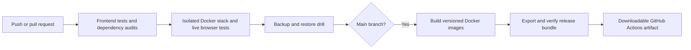

# Phase 6: automatic verification and release delivery

The workflow in `.github/workflows/ci.yml` runs on pushes to main, pull requests
and manual dispatch. It uses read-only repository permissions and actions
pinned to full commit hashes.



Verification covers frontend request helpers and mocked browser interactions,
backend contracts and security, real PostgreSQL and Redis, migrations, Nginx,
live browser CRUD/conflicts, volume persistence and recovery. npm and pip-audit
check dependency vulnerabilities. A failed stage prevents release delivery.

After successful main-branch checks, the release job packages four images:
React/Nginx, FastAPI (also used for migrations), PostgreSQL and Redis. Tags
identify the Git revision for application images; `release.json` records all
image IDs and the archive's SHA256. The job loads this archive and starts a
fresh project with `--no-build --pull never`, verifies health and CRUD, then
removes its temporary volumes. This tests the actual delivery format.

Find the `notes-release-<commit>` artifact on the successful Actions run; it is
retained for 14 days. Download it before expiration or keep an independent
copy. The exact allowlist includes only images, Compose files, example
configuration, image tags, manifest and instructions. Private `.env` files,
note backups and source test data are not uploaded. Failed browser traces are
retained for seven days; CI tests use disposable synthetic notes.

Local equivalents (PowerShell 7, Docker running):

```powershell
cd frontend
npm ci
npx playwright install chromium
npm test
cd ..
./scripts/verify-stack.ps1 -BrowserTests
./scripts/verify-recovery.ps1
./scripts/export-release.ps1
# Use the output directory printed by export-release:
./scripts/verify-release.ps1 -BundlePath ./artifacts/releases/<commit>
```

Choose a new `-OutputDirectory` when repeating export for the same revision.
An existing destination is refused to avoid mixing releases. Export packages
the current source files: use a clean committed checkout for a distributable
release. CI always checks out the exact workflow commit. Linux and Windows
hosts can run these PowerShell scripts with PowerShell 7.

Delivery ends at the tested downloadable bundle. Automatic deployment to a
public server requires a selected hosting destination and credentials; none
are configured. See [the bundle instructions](release-bundle.md) for startup.
Protect main with required `verify` and `release` checks in GitHub repository
settings if you want checks to block merges (the workflow alone does not
change branch protection).

References: [GitHub workflow syntax](https://docs.github.com/en/actions/reference/workflows-and-actions/workflow-syntax),
[Compose reset overrides](https://docs.docker.com/reference/compose-file/merge/).
